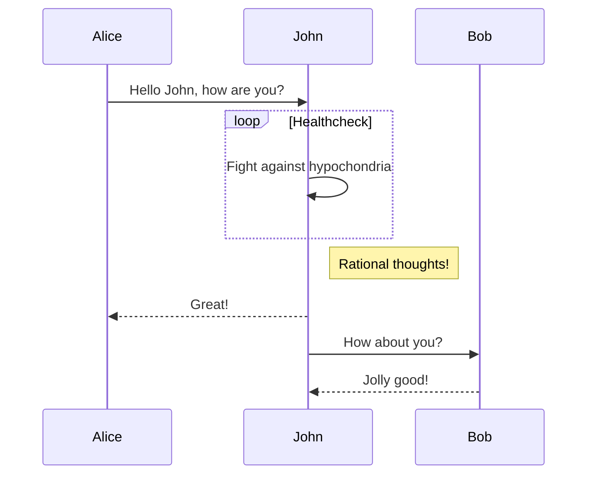

# Sui Move typescript examples

Examples presenting capabilities of the sui move typescript sdk

## Preparing development environment

First of all, make sure you have node JS installed.  Run `npm --version` to check this. If you haven't install node yet, got to [Node JS Official Website](https://nodejs.org/en/download/) and follow installation instructions depending on your operating system.

Create a local development folder, navigate to it through terminal, and run  `npm install @mysten/sui.js` to download sui sdk and prepare your local development environment.

## Execution 

Typescript need to be transpiled to javascript to be ready for execution. However we can run it with a single command: ts-node. 

To run each file use: `ts-node FILENAME.ts` for example: `ts-node 01_ObjectsByAddress.ts` 

## Sequence test

